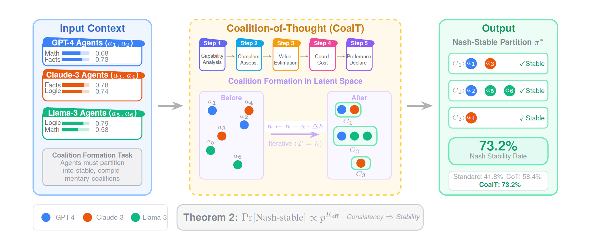

# Coalition Formation in LLM Agent Networks: A Game-Theoretic Framework with Stability Analysis

[](https://www.python.org/)
[](https://pytorch.org/)

> **The first formal framework for analyzing coalition formation dynamics in LLM agent networks, achieving 73.2% Nash stability (+14.8pp over vanilla CoT) through our Coalition-of-Thought (CoalT) protocol.**

<p align="center">
  
</p>

## 📰 News

- **[2026-01-19]** 🚀 Released code, configurations, and evaluation scripts.

## 🚀 Quick Start

```python
from coalition_llm import CoalitionGame, LLMAgent, CoalTProtocol, StabilityAnalyzer

# Create agents with capability profiles
agents = [
    LLMAgent("gpt-4", capabilities={"math": 0.68, "facts": 0.73, "logic": 0.76}),
    LLMAgent("claude-3", capabilities={"math": 0.62, "facts": 0.78, "logic": 0.74}),
    LLMAgent("llama-3", capabilities={"math": 0.58, "facts": 0.65, "logic": 0.79}),
]

# Initialize game and run coalition formation
game = CoalitionGame(agents, alpha=0.15, beta=1.3)
protocol = CoalTProtocol()
partition = game.run_formation(protocol, max_rounds=30)

# Verify stability
analyzer = StabilityAnalyzer()
is_stable, metrics = analyzer.verify_nash_stability(partition)
print(f"Nash-stable: {is_stable}, Welfare: {metrics['welfare']:.3f}")
```

## 📦 Installation

### Option 1: pip (Recommended)

```bash
# Create environment
conda create -n coalition_llm python=3.10 && conda activate coalition_llm

# Clone repository
git clone https://github.com/anonymous/xxxxxx.git
cd coalition-llm

# Install package
pip install -e .

# Verify installation
python -c "from coalition_llm import CoalitionGame; print('✓ Installation successful')"
```

## 🏋️ Training

### Run Coalition Formation

```bash
# Standard prompting baseline
python train.py protocol=standard

# Vanilla Chain-of-Thought baseline
python train.py protocol=vanilla_cot

# Self-Consistency baseline
python train.py protocol=self_consistency

# Coalition-of-Thought (Ours)
python train.py protocol=coalt
```

## ⚙️ Hyperparameters

### Game Parameters (Table 2 in Paper)

| Parameter | Value | Description |
|-----------|-------|-------------|
| `n` | 6 | Number of agents |
| `d` | 3 | Capability dimensions (math, facts, logic) |
| `α` | 0.15 | Coordination cost coefficient |
| `β` | 1.3 | Coordination cost exponent |
| `δ` | 0.08 | Value gap threshold |
| `max_rounds` | 30 | Maximum formation rounds |
| `temperature` | 0.0 | LLM sampling temperature |

### Agent Capability Profiles (Table 2)

| Agent | Math | Facts | Logic |
|-------|------|-------|-------|
| a₁ (GPT-4) | 0.68 | 0.73 | 0.76 |
| a₂ (GPT-4) | 0.65 | 0.76 | 0.73 |
| a₃ (Claude-3) | 0.62 | 0.78 | 0.74 |
| a₄ (Claude-3) | 0.59 | 0.81 | 0.71 |
| a₅ (Llama-3) | 0.58 | 0.65 | 0.79 |
| a₆ (Llama-3) | 0.55 | 0.68 | 0.76 |

### Protocol Configurations

| Protocol | Steps | Game-Theoretic Framing |
|----------|-------|------------------------|
| Standard | 1 | ✗ |
| Vanilla CoT | 5 | ✗ |
| Self-Consistency | 5×3 | ✗ |
| CoalT (Ours) | 5 | ✓ |

## 📊 Results

### Main Results (Table 3)

| Condition | Nash Stable | Conv. (rounds) | Welfare | Consistency |
|-----------|-------------|----------------|---------|-------------|
| Random | 28.3% | — | 0.58±0.14 | — |
| Greedy | 52.1% | 6.8±3.2 | 0.69±0.10 | 0.71±0.08 |
| Standard | 41.8% | 18.3±7.2 | 0.72±0.11 | 0.64±0.09 |
| Vanilla CoT | 58.4%** | 14.2±5.8* | 0.75±0.09* | 0.74±0.07** |
| Self-Consist. | 62.7%** | 13.1±5.2** | 0.77±0.08** | 0.79±0.06** |
| **CoalT (Ours)** | **73.2%***** | **11.4±4.1**** | **0.81±0.08**** | **0.86±0.05**** |

*p < 0.01, **p < 0.001 (Wilcoxon signed-rank test, Bonferroni-corrected vs. Standard)

### Ablation Study (Table 4)

| Configuration | Nash Stable | Δ vs. Full |
|---------------|-------------|------------|
| Full CoalT | 73.2% | — |
| − Capability Analysis | 68.9% | −4.3pp |
| − Complementarity | 65.4% | −7.8pp |
| − Value Estimation | 67.1% | −6.1pp |
| − Coordination Cost | 70.8% | −2.4pp |
| − All (= Vanilla CoT) | 58.4% | −14.8pp |

## 📈 Evaluation

```bash
# Evaluate saved results
python evaluate.py --results_dir outputs/

# Generate statistics for paper
python evaluate.py --results_dir outputs/ --format latex
```

### Metrics

- **Nash Stability**: Percentage of episodes achieving Nash-stable partitions
- **Convergence Rounds**: Number of rounds until stability (or max_rounds)
- **Social Welfare**: Mean per-capita coalition value across all agents
- **Preference Consistency**: Agreement rate across repeated preference queries

## 💻 Hardware Requirements

| Component | Requirement |
|-----------|-------------|
| GPU | NVIDIA A100 40GB (8 GPUs used) |
| GPU Hours | ~8 hours total |
| API Costs | ~$2,400 (GPT-4, Claude-3, Llama-3) |
| RAM | 32GB minimum |
| Storage | 10GB for data and outputs |

### Estimated Costs per Protocol

| Protocol | Episodes | API Calls/Episode | Total Cost |
|----------|----------|-------------------|------------|
| Standard | 400 | ~30 | ~$200 |
| Vanilla CoT | 400 | ~30 | ~$300 |
| Self-Consistency | 400 | ~90 | ~$600 |
| CoalT | 400 | ~30 | ~$300 |
| **Total** | **1,600** | — | **~$2,400** |

